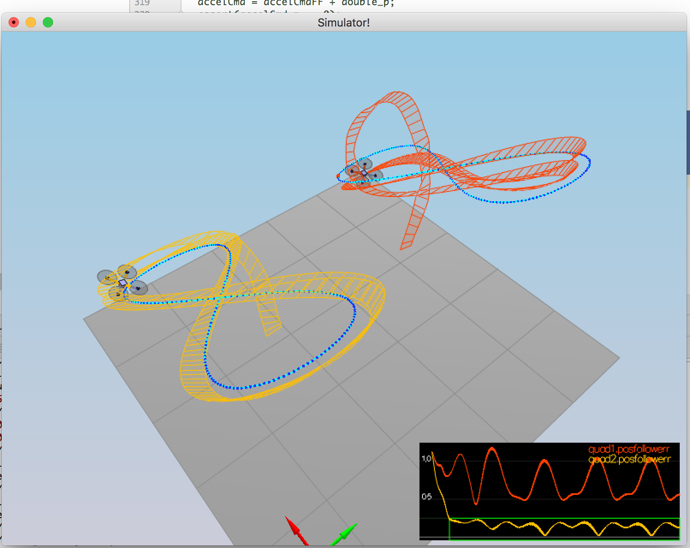

# The C++ Control Project

A cascaded PID controller has been implemented to control the quad copter. 



# Shortcomings

Due to shortage of time, the following are some shortcomings that will need to be rectified in future

. Scenario 5, red drone needs to be tuned   
. LateralPositionControl, acts more like a PD rather than a cascaded controller   

## Rubric Points

### Body Rate Control

A simple propotional controller has been implemented that uses `kpPQR` as the gain variable for minimizing the error between the commanded PQR (attitude of the quad in body frame) and the current attiude.

Returns the moment, which is defined as `M = I * α`, where α is the propotional gain and I is the moment of intertia vector given by `Ixx, Iyy, Izz`

### Roll Pitch Control

A simple propotional controller that uses `kpBank` as the gain variable. The function returns the required acceleration in the body frame (pqr).

Implementation uses formulae from lecture notes, specifically Lecture 14 - Lesson 4.2:

bx_c_dot = kpBank * (bx_c - bx_a)   
by_c_dot = kpBank * (by_c - by_a)

where *bx_c = commanded acceleration in body frame*, *bx_a is the actual acceleration* in the body frame

### Altitude Controller

A PID controller has been implemented for controlling the altitude of the quad copter.

For P gain is controlled by: kpPosZ   
For D gain is controlled by: kpVelZ   
For I gain is controlled by: KiPosZ   

First the required control is computed and then required acceleration is computed. Required acceleration is constrained to be within maxDescent and maxAscent rates. 

The function returns thrust using the mass and acceleration computed.

### Lateral Position Controller

This function is reponsible for figuring out the acceleration required in X and Y axis given the next trajectory position and velocity and the current position and velocity.

I tried implementing a cascaded controller (ref: [https://www.overleaf.com/read/bgrkghpggnyc#/61023787/](https://www.overleaf.com/read/bgrkghpggnyc#/61023787/)) but just could not get it to tune within the given time frame. Have instead implemented a PD controller that uses `kpVelXY` as the derivative gain on the velocity error.

```
	V3F error_pos = posCmd - pos;
	V3F error_v = velCmd - vel;

	V3F term1 = kpPosXY * error_pos;
	V3F term2 = kpVelXY * error_v;
```

This function returns the required acceleration in X and Y direction.

### Yaw Controller

A simple propotional controller has been implemented for controlling the yaw. The required yaw is first constrained to be within -2π and 2π. Then the error computed is again ensured to be within 2π range.

`kpYaw` is the gain parameter

### Generate Motor Commands

Basic formula used is: `Thrust = Moment * l`

To figure out thrust a simultaneous equation solver has been used that uses the following constraints:

All four motor thrust is added to equal the given collThrustCmd

Combined thrust from left two motors (F1+F3) is subtracted from the combined thrust from right two motors (F2+F4) to give moment around X

Combined thrust from front two motors (F1+F2) is subtracted from the combined thrust from back two motors (F3+F4) to give moment around Y

Combined thrust from clock wise motors (F1 + F4) is substracted from the anti clockwise motors (F2+F3) to get moment around z axis.

[Equation for Thrust](https://www.wolframalpha.com/input/?i=%7B%7B1,1,1,1%7D,%7B1,-1,1,-1%7D,%7B1,1,-1,-1%7D,%7B-1,1,1,-1%7D%7D+*+%7BF0,F1,F2,F3%7D+%3D+%7BA,B,C,D%7D)

## Tuning Method Used

The controller was tuned manually by increasing each value by not more than 10% of its current value.

### Future Work

. Use twiddle algorithm as described by Sebastian   
. Use gradient descent for tuning as described by Andrew Ng in his lecture notes

## Testing Methodology

### Motor Thrust 

Altitude, roll, pitch and yaw were all confirmed by manually setting `desMoment` in RunControl just before calling generateMotorCommands in RunControl function.

```
ParamsHandle config = SimpleConfig::GetInstance();
float L = config->Get(_config + ".L", 0);
float l = L / sqrt(2);

collThrustCmd = mass * CONST_GRAVITY;

desMoment.x = 0;
desMoment.y = 0;
desMoment.z = 0;

return GenerateMotorCommands(collThrustCmd, desMoment);
```

For Hover:

```
collThrustCmd = mass * CONST_GRAVITY;
desMoment.x = 0;
desMoment.y = 0;
desMoment.z = 0;
```

For Positive Altitude:

```
collThrustCmd = mass * 1.5 * CONST_GRAVITY;
desMoment.x = 0;
desMoment.y = 0;
desMoment.z = 1;
```


For Roll:

```
collThrustCmd = mass * CONST_GRAVITY;
desMoment.x = 1.0 / 180.0 * M_PI * l;
desMoment.y = 0;
desMoment.z = 0;
```

For Pitch:

```
collThrustCmd = mass * CONST_GRAVITY;
desMoment.x = 0;
desMoment.y = 1.0 / 180.0 * M_PI * l;;
desMoment.z = 0;
```