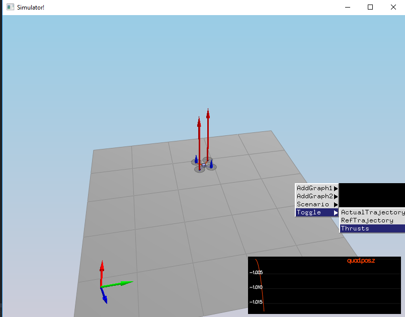
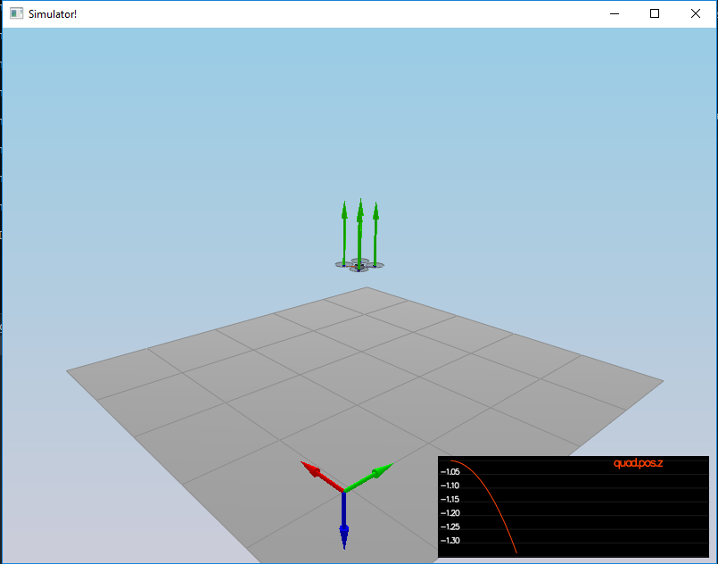
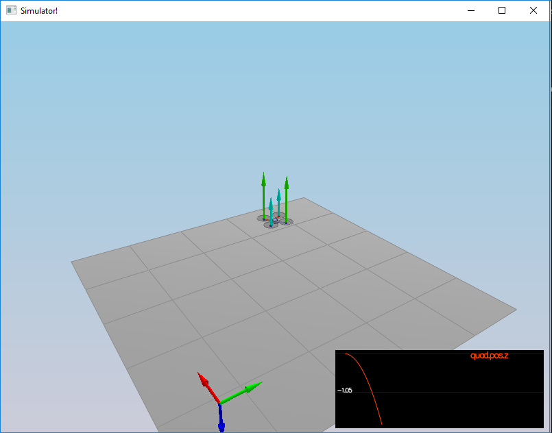
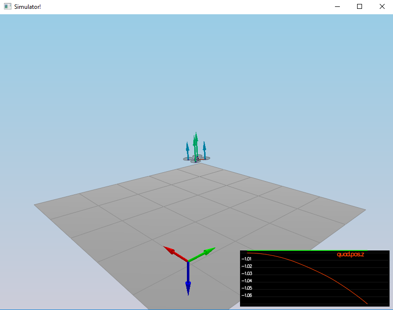
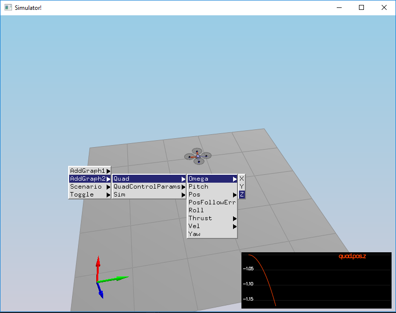
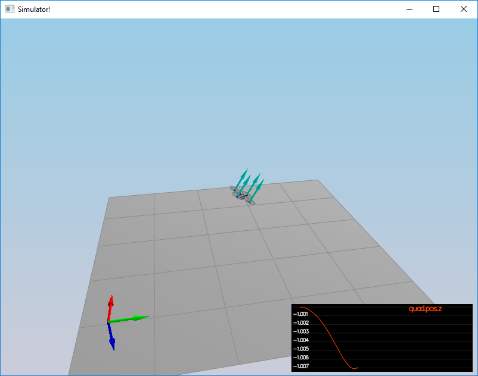
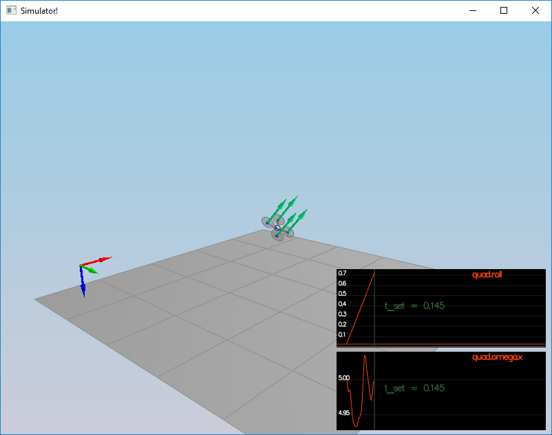

# Shortcomings

1) I thought the whole point of having a cascaded controller was to minimize effect of parameters across control loop. But changing `kpPosXY` for controlling LateralPosition, the roll/pitch control can go erratic.

# Debugging

## How to debug GenerateMotorCommands

Use scenario1 for debugging motor controls

### Turn on Thrust in simulator

You can toggle thrust to give you an idea about the motor thrusts being generated:



### Make sure setting VehicleCmd has an effect in the scenario

Towards the end of function `VehicleCommand QuadControl::RunControl(float dt, float simTime)`, set desired thrust manually to generate lift:

```
collThrustCmd = 2 * mass * CONST_GRAVITY;
// return GenerateMotorCommands(collThrustCmd, desMoment);
VehicleCommand cmd;
cmd.desiredThrustsN[0] = cmd.desiredThrustsN[1] = cmd.desiredThrustsN[2] = cmd.desiredThrustsN[3] = collThrustCmd / 4;

return cmd;
```



### Generate some manual yaw

```
collThrustCmd = 2 * mass * CONST_GRAVITY;
// return GenerateMotorCommands(collThrustCmd, desMoment);

VehicleCommand cmd;

cmd.desiredThrustsN[1] = cmd.desiredThrustsN[2] = collThrustCmd / 4;
cmd.desiredThrustsN[0] = cmd.desiredThrustsN[3] = (collThrustCmd / 4) * 0.5;

return cmd;
```



### Generate lift through GenerateMotorCommands

```
collThrustCmd = 2 * mass * CONST_GRAVITY;
desMoment.x = 0;
desMoment.y = 0;
desMoment.z = 0;

VehicleCommand cmd = GenerateMotorCommands(collThrustCmd, desMoment);
return cmd;
```

### Generate yaw through GenerateMotorCommands (and confirm direction)

Generate some positive yaw moment e.g. one radian. Also notice the direction of rotation, should be clockwise.

```
	ParamsHandle config = SimpleConfig::GetInstance();
	float L = config->Get(_config + ".L", 0);
	float l = L / sqrt(2);

	collThrustCmd = mass * CONST_GRAVITY;
	desMoment.x = 0;
	desMoment.y = 0;
    desMoment.z = 10.0/180.0 * M_PI * l;

	VehicleCommand cmd = GenerateMotorCommands(collThrustCmd, desMoment);
```


Confirm yaw movement in other direction as well using `desMoment.z = -10.0/180.0 * M_PI * l;`

Plot omega (p,q,r rotational velocity in body frame), you should see Z increasing gradually




### Confirm roll

Generate some positive roll and ensure direction is correct:

```
	ParamsHandle config = SimpleConfig::GetInstance();
	float L = config->Get(_config + ".L", 0);
	float l = L / sqrt(2);

	collThrustCmd = mass * CONST_GRAVITY;
	//desMoment.x = 0;
	desMoment.x = 10.0 / 180.0 * M_PI * l;
	desMoment.y = 0;
	desMoment.z = 0;
	//desMoment.z = -10.0/180.0 * M_PI * l;

	VehicleCommand cmd = GenerateMotorCommands(collThrustCmd, desMoment);
```



## Confirm pitch

Confirm that the pitch is working they way you think it should. Generate positive and then negative pitch to view the effect.

```
	ParamsHandle config = SimpleConfig::GetInstance();
	float L = config->Get(_config + ".L", 0);
	float l = L / sqrt(2);

	collThrustCmd = mass * CONST_GRAVITY;
	desMoment.x = 0;
	desMoment.y = 10.0 / 180.0 * M_PI * l;
	desMoment.z = 0;

	VehicleCommand cmd = GenerateMotorCommands(collThrustCmd, desMoment);
	return cmd;
```

## Debugging BodyRateControl

Quad is setup to have a positive roll. Change the roll rate to something smaller so that it is easier to debug and view what is happening.

Keep a copy of `config/2_AttitudeControl.txt` to restore later on.

Change line #21 from `Quad.InitialOmega=30,0,0` to `Quad.InitialOmega=30,0,0`. Change `VehicleCommand QuadControl::RunControl(float dt, float simTime)` to return 0 moments, just to see what the quad is doing:

```
desMoment.x = 0;
desMoment.y = 0;
desMoment.z = 0;

VehicleCommand cmd = GenerateMotorCommands(collThrustCmd, desMoment);
return cmd;
```



Just to have a better understanding, generate a roll in the other direction to stop the roll BUT this will make the quad go in the other direction, which is ok as we just want to see what kind of control is required.

```
	ParamsHandle config = SimpleConfig::GetInstance();
	float L = config->Get(_config + ".L", 0);
	float l = L / sqrt(2);

	desMoment.x = -20 / 180.0 * M_PI * l;
	desMoment.y = 0;
	desMoment.z = 0;

	VehicleCommand cmd = GenerateMotorCommands(collThrustCmd, desMoment);
```
Now, start looking into your function `BodyRateControl`. You can turn off rollpitchcontrol by setting `kpBank = 0` in `config/2_AttitudeControl.txt`.

You can set `BodyRateControl` to generate commands only to control the roll `desMoment.x` so that it is easier to debug. 

```
V3F QuadControl::BodyRateControl(V3F pqrCmd, V3F pqr)
{
    .....
    
	momentCmd.y = 0;
	momentCmd.z = 0;

	/////////////////////////////// END STUDENT CODE ////////////////////////////

    return momentCmd;
}
```

Switch on y and z once you are able to control it in the X direction. Change `config/2_AttitudeControl.txt` line #21 back to `Quad.InitialOmega=30,0,0` and make sure the quad can still fly.

## Debugging RollPitchControl

The RollPitchControl figures out the required atttiude and then feeds that into the BodyRateControl. Couldn't figure out an easy way of debugging this.

## Yaw Control

`kpYaw` is the factor that needs to be tuned

## Debugging LateralPositionControl

Copy 3_PositionControl.txt to 3_1_PositionControl.txt and do the following changes:

### Quad 1 (on the right)

1) Make it come down from top

[Quad1:Quad]
InitialPos=0, 0, -3
TrajectoryOffset=0, 0, -1


### Quad 2 (on the left)

1) Make it go left
2) Once successful, make it go down and left at the same time
